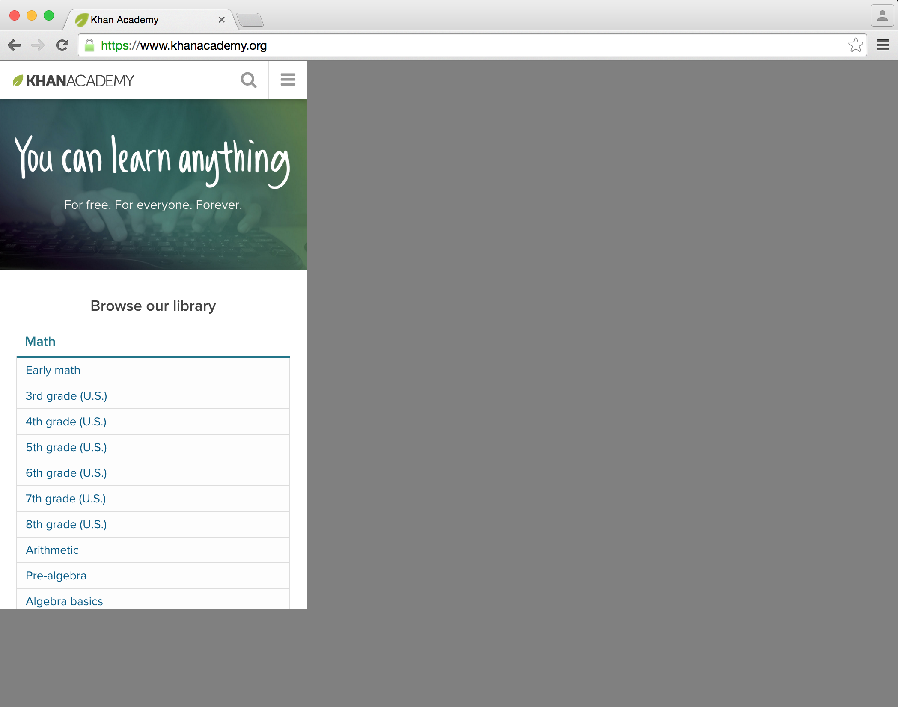

# Watir::Device

[](http://badge.fury.io/rb/watir-device)

Automate Chrome Developer Tools' device emulation with watir-webdriver.



## Installation

Add this line to your application's Gemfile:

```ruby
gem 'watir-device'
```

And then execute:

    $ bundle

Or install it yourself as:

    $ gem install watir-device

## Usage

Instantiate an emulated device much like you would a `Watir::Browser` object. Just pass it a valid device string:

```ruby
require 'watir-device'
device = Watir::Device.new "Samsung Galaxy Note 3"
device.goto "www.google.com"
```

```ruby
require 'watir-device'
device = Watir::Device.start "www.google.com", "Samsung Galaxy Note 3"
```

#### Methods

All methods you normally use with `Watir::Browser` are available to your `Watir::Device` object. The `Watir::Browser` object itself is available via `Watir::Device#browser`, though you shouldn't need to access it.

```ruby
device = Watir::Device.new "Samsung Galaxy Note 3"
device.browser
#=> <Watir::Browser:0x...>
```

## Contributing

1. Fork it ( https://github.com/[my-github-username]/watir-device/fork )
2. Create your feature branch (`git checkout -b my-new-feature`)
3. Commit your changes (`git commit -am 'Add some feature'`)
4. Push to the branch (`git push origin my-new-feature`)
5. Create a new Pull Request
